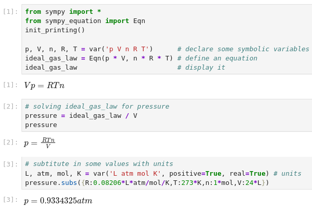
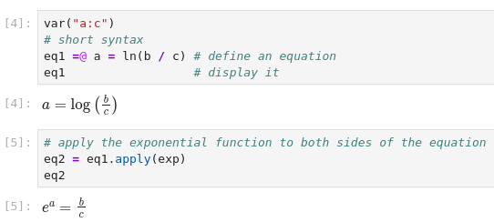

# sympy_equation


This package defines relations that all high school and college students would
recognize as mathematical equations, consisting of a left hand side (lhs) and
a right hand side (rhs) connected by the relation operator "=". This is
implemented by the ``Equation`` class, which also supports mathematical
operations applied to both sides simultaneously, just as students are taught
to do when  attempting to isolate (solve for) a variable. Thus the statement
``Equation/b`` yields a new equation ``Equation.lhs/b = Equation.rhs/b``.

The intent is to allow using the mathematical tools in SymPy to rearrange
equations and perform algebra in a stepwise fashion using as close to standard
mathematical notation as  possible. In this way more people can successfully
perform  algebraic rearrangements without stumbling over missed details such
as a negative sign.

A simple example as it would appear in a [Jupyter](https://jupyter.org)
notebook is shown immediately below:



In IPython environments (IPython, Jupyter, Google  Colab, etc...) there is
also a shorthand syntax for entering equations provided through the IPython
preparser. An equation can be specified as ``eq1 =@ a/b = c/d``.




If no Python name is specified for the equation (no ``eq_name`` to the left of ``=@``), the equation will still be defined, but will not be easily accessible
for further computation. The ``=@`` symbol combination was chosen to avoid
conflicts with reserved python  symbols while minimizing impacts on syntax
highlighting and autoformatting.

[More examples of the capabilities of Algebra with Sympy are
here](https://gutow.github.io/Algebra_with_Sympy/Demonstration%20of%20equation%20class.html).


## Installation


``sympy_equation`` can be installed with ``pip`` or ``conda``.

```
pip install sympy_equation
```

Or

```
conda install -c conda-forge sympy_equation
```


## Customizing the module


``equation_config`` is an object containing a few properties to customize
the behaviour of the module:

```py
from sympy_equation import equation_config
```

Arguably the most useful options are  :

* ``equation_config.integers_as_exact`` (default is False).
  When it's True and we are running in an IPython/Jupyter environment,
  it preparses the content of a code line in order to convert integer numbers
  to sympy's Integer. In doing so, we can write 2/3, which will be
  converted to Integer(2)/Integer(3), which then SymPy converts
  to Rational(2, 3). If False, no preparsing is done, and Python evaluates
  2/3 to 0.6666667, which will then be converted by SymPy to a Float.
* ``equation_config.latex_printer`` (default is ``latex``). It allows to
  provide a callable to a custom latex printer. This can be useful,
  for example, to modify the way undefined applied functions are rendered.
* ``equation_config.show_label`` (default is False). When it's True, a label
  with the name of the equation in the python environment will be shown on
  the screen.

Check out the documentation to read more about these and other options.


## Differences between sympy_equation and algebra_with_sympy


* ``sympy_equation`` is a fork of [algebra_with_sympy](https://github.com/gutow/Algebra_with_Sympy), starting from the version 1.0.2.
* ``algebra_with_sympy`` installs a custom version of SymPy, which exposes
  the ``Equation`` class. The basic idea is to better integrate the ``Equation``
  class with other SymPy functionalities. The downside is that as new releases
  of SymPy are available, the users of ``algebra_with_sympy`` must wait for a
  new version of the package to be released as well.
  Differently, ``sympy_equation`` is an external package that only depends on
  SymPy: as new releases of SymPy are available, ``sympy_equation`` will work
  with them right away. The downside is that it might not be as integrated with
  SymPy's functionalities as one would like it to be.
* ``algebra_with_sympy`` exposes the ``algwsym_config`` object to customize
  the behaviour of the module. Similarly, ``sympy_equation`` exposes the
  ``equation_config``. The available options are very similar, but their
  default values are often different.
