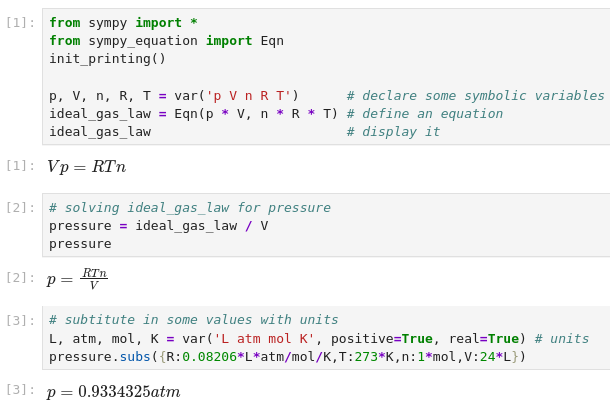
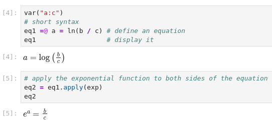

Welcome to sympy_equation's documentation!
==========================================

``sympy_equation`` defines relations that all high school and college students
would recognize as mathematical equations, consisting of a left hand side (lhs)
and a right hand side (rhs) connected by the relation operator "=". This is
implemented by the ``Equation`` class, which also supports mathematical
operations applied to both sides simultaneously, just as students are taught
to do when  attempting to isolate (solve for) a variable. Thus the statement
``Equation/b`` yields a new equation ``Equation.lhs/b = Equation.rhs/b``.

The intent is to allow using the mathematical tools in `SymPy <https://docs.sympy.org/latest/index.html>`_
to rearrange equations and perform algebra in a stepwise fashion using as
close to standard mathematical notation as possible. In this way more people
can successfully perform algebraic rearrangements without stumbling over
missed details such as a negative sign.

A simple example as it would appear in a `Jupyter <https://jupyter.org>`_
notebook is shown immediately below:

In IPython environments (IPython, Jupyter, Google  Colab, etc...) there is
also a shorthand syntax for entering equations provided through the IPython
preparser. An equation can be specified as ``eq1 =@ a/b = c/d``.

The ``=@`` symbol combination was chosen to avoid conflicts with reserved
python symbols while minimizing impacts on syntax highlighting and
autoformatting.

Development and Support
=======================

If you feel like a feature could be implemented, open an
`issue or create a PR <https://github.com/Davide-sd/sympy_equation/issues>`_.
Implementing new features and fixing bugs requires time and energy too.
If you found this module useful and would like to show your appreciation,
please consider sponsoring this project with either one of these options:

.. button-link:: https://www.buymeacoffee.com/davide_sd
    :color: primary

    :fas:`mug-hot;fa-xl` Buy me a Coffee

.. button-link:: https://github.com/sponsors/Davide-sd
    :color: primary

    :fab:`github;fa-xl` Github Sponsor :fas:`heart;fa-xl`

.. toctree::
   :maxdepth: 1
   :caption: Contents:

   install.rst
   differences.rst
   module.rst
   tutorials/index.rst
   changelog.rst